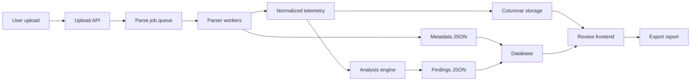

# Architecture

## Recommended Direction

Use a parse-once, review-many architecture.

The old PX4 Flight Review style is proven: upload logs, analyze in browser,
interactive plots, and share review pages. The more modern Flight Review v2
direction is even better for our product: convert raw logs once into efficient
review artifacts, then let the frontend query those artifacts quickly.

## High-Level Architecture



## Components

### Frontend

Suggested stack:

- React or SvelteKit
- Plotly, uPlot, ECharts, or Bokeh-compatible embedded plots
- CesiumJS for the primary 3D route map, with MapLibre/Leaflet or SVG fallback
- A public Cesium ion token injected as `CESIUM_ION_TOKEN` for hosted imagery
  and terrain
- DuckDB-WASM or Apache Arrow for large local table exploration

Responsibilities:

- Upload UX and parse status
- Review dashboard
- Synchronized plots
- Cesium map and timeline interaction
- Findings review workflow
- Export/share UI

### Backend API

Suggested stack:

- Python FastAPI for fast iteration, or Rust for a high-performance parser
  service later.
- PostgreSQL for review metadata.
- Local filesystem in development, S3-compatible object storage in production.
- Background jobs with RQ/Celery/Arq or a lightweight worker process.

Responsibilities:

- Upload validation
- Job creation and status
- Serving review metadata
- Authentication and sharing
- Export generation

### Parser Layer

Parser adapters:

- PX4 `.ulg`: `pyulog` first, possible Rust parser later.
- ArduPilot `.bin` / `.log`: `pymavlink` DataFlash.
- Mission Planner `.tlog`: `pymavlink` MAVLink telemetry.

Output:

- `metadata.json`
- `events.json`
- `findings.json`
- normalized topic tables, ideally Arrow/Parquet

### Analysis Engine

Analysis modules:

- Data quality
- GPS
- Estimator
- Power
- Vibration
- Attitude/rate control
- Position control
- Mission/failsafe
- Messages and errors

Each module returns findings with:

- severity
- confidence
- title
- time range
- affected subsystem
- evidence values
- chart/topic links
- recommendation

## Data Model Sketch

### Review

- `id`
- `created_at`
- `log_type`
- `vehicle_type`
- `firmware`
- `duration_s`
- `distance_m`
- `health_score`
- `privacy_mode`
- `status`

### Finding

- `id`
- `review_id`
- `severity`
- `subsystem`
- `title`
- `start_us`
- `end_us`
- `confidence`
- `evidence_json`
- `recommendation`
- `reviewer_status`
- `reviewer_note`

### Artifact

- `review_id`
- `artifact_type`
- `uri`
- `content_type`
- `size_bytes`
- `checksum`

## Deployment Modes

### Local Engineering Mode

- Runs on one machine.
- Stores artifacts locally.
- No login required.
- Best for private flight logs.

### Hosted Team Mode

- Login required.
- Stores metadata in Postgres.
- Stores artifacts in S3-compatible storage.
- Supports share links, retention policy, and redaction.

## Important Design Decisions

- Do not parse raw logs repeatedly for every page load.
- Keep analysis outputs explainable and evidence-first.
- Preserve raw-topic access for expert users.
- Allow missing-data limitations instead of pretending every check is certain.
- Keep parser adapters isolated from the common review UI.
- Treat Cesium as an optional visualization layer over normalized telemetry, not
  as the source of truth. The route must still be exportable and reviewable when
  imagery/terrain services are unavailable.

## Cesium Route Data Contract

The parser/analysis layer should produce a compact route artifact for the UI:

```json
{
  "points": [
    {
      "time_s": 0.0,
      "lat": 33.6844,
      "lon": 73.0479,
      "alt_m": 12.4,
      "relative_alt_m": 0.0,
      "mode": "MANUAL",
      "armed": false,
      "groundspeed_m_s": 0.0,
      "battery_remaining_pct": 100.0
    }
  ],
  "events": [
    {
      "time_s": 42.5,
      "kind": "TAKEOFF",
      "label": "Takeoff detected",
      "lat": 33.6851,
      "lon": 73.0492,
      "alt_m": 28.0
    }
  ]
}
```

The frontend should convert route points to Cesium positions with
`Cartesian3.fromDegrees(lon, lat, alt_m)`, create polyline entities for each
mode segment, add event markers, then fly the camera to the route bounds.
